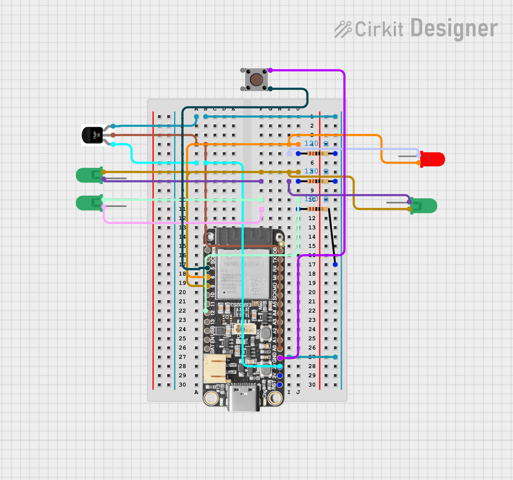
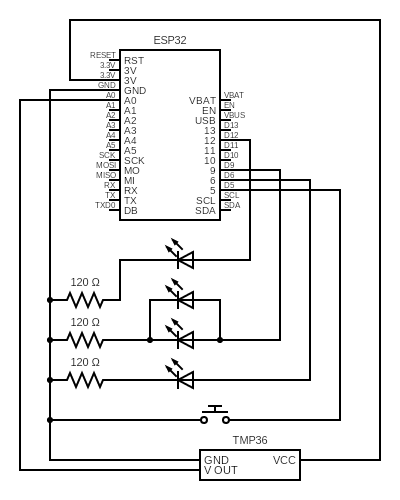
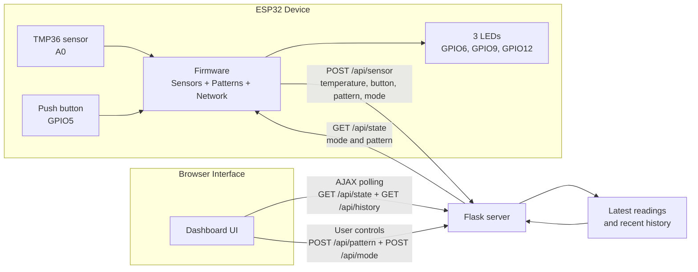

# COM3505 Internet of Things Assignment Report

## Title

Smart Ambient Monitoring Node: ESP32 Sensor and LED Control via Flask Web Interface

## 1. Introduction

This project implements an IoT system using an ESP32 Feather board, a TMP36 temperature sensor, a push button input, and three LEDs controlled through a Python Flask web interface. The aim was to satisfy the assignment requirements for sensing, actuation, networking, and browser-based monitoring while keeping the design modular and reliable.

The final system reads sensor data on the ESP32, connects to local Wi-Fi, sends telemetry to a Flask server, and displays live information in a browser dashboard. The dashboard also allows LED pattern selection and switching between manual and automatic modes. The push button acts as a local digital input and can cycle LED patterns directly on the device in manual mode.

## 2. Hardware Setup

The hardware used in the current build is:

- Adafruit Feather ESP32-S3
- TMP36 temperature sensor
- push button
- 3 LEDs
  - red
  - yellow
  - green
- 3 current-limiting resistors
- Breadboard and jumper wires

The TMP36 sensor output is connected to analog pin `A0` on the ESP32. The push button is connected between GPIO `5` and ground and uses the ESP32 internal pull-up resistor. The three LEDs are connected to GPIO pins `6`, `9`, and `12`, matching the firmware pin map in `Pins.h`. Each LED is connected in series with a resistor.

Figure 1: Breadboard wiring for the ESP32 ambient monitoring node, showing the TMP36 temperature sensor, push button input, and three LED outputs.

Figure 2: Circuit schematic showing the ESP32 connections to the TMP36 sensor, push button, and LED/resistor output paths.

## 3. System Architecture

The system has three main parts:

- ESP32 firmware
- Flask backend
- browser dashboard

The ESP32 reads sensors, generates LED patterns, and sends data over Wi-Fi. The Flask server acts as the coordination layer between the hardware and the browser. The browser dashboard displays live values and sends control commands back to the server, which are then read by the ESP32.

High-level data flow:

1. The ESP32 samples the temperature sensor and digital button input.
2. The ESP32 updates the LED pattern engine.
3. The ESP32 sends the latest device state and sensor values to Flask using HTTP and JSON.
4. Flask stores the latest readings and current mode/pattern state.
5. The dashboard polls the server using JavaScript and updates the page without refresh.
6. Pattern and mode changes made in the browser are sent back to Flask and then fetched by the ESP32.
7. In manual mode, a local push-button press can cycle to the next LED pattern and the updated state is pushed back to Flask so the dashboard remains in sync.

Figure 3: System architecture showing the ESP32 device, connected sensors and LEDs, Flask coordination layer, and browser-based monitoring and control.

## 4. Firmware Design

The firmware is structured as a modular PlatformIO project rather than a single Arduino sketch. This improves readability and separates responsibilities clearly.

The main firmware modules are:

- `main.cpp`: Arduino entry point
- `Thing.cpp`: top-level orchestration and shared state
- `Sensors.cpp`: sensor sampling
- `Patterns.cpp`: LED pattern engine
- `Network.cpp`: Wi-Fi and HTTP communication

This design avoids putting unrelated logic into a single `loop()` function. Instead, the system maintains a shared `DeviceState` structure and updates sensing, animation, and networking separately.

### Sensor Reading

The current build uses a TMP36 temperature sensor and a push button input. Temperature is read through the ESP32 ADC and converted into degrees Celsius. The button is read using `INPUT_PULLUP`, so a pressed state is detected when the pin reads `LOW`. Sensor sampling is scheduled with `millis()` so the firmware remains responsive.

### LED Pattern Engine

The system controls three LEDs using a logical LED buffer with red, yellow, and green channels. Implemented patterns include blink, chase, cycle, alert, pulse, and heartbeat. The active pattern is updated using non-blocking timing. In manual mode, the user can choose a pattern from the browser or cycle through patterns locally using the push button.

### Timing Strategy

The firmware uses `millis()`-based scheduling instead of blocking delays so the device can handle sensor reading, LED animation, and server communication concurrently. Separate timers improve responsiveness and stability.

## 5. Wi-Fi and Server Communication

The ESP32 connects to the local Wi-Fi network in station mode. Once connected, the firmware prints the IP address to the serial monitor for debugging and troubleshooting. It then communicates with the Flask server using HTTP requests with JSON payloads.

The main API interactions are:

- `POST /api/sensor`
  - uploads current sensor values, button state, and device state
- `GET /api/state`
  - fetches the latest mode and pattern

This keeps the ESP32 side simple while still supporting live interaction with the browser interface.

## 6. Flask Server and Web Interface

The Flask server stores the latest sensor values, the active LED pattern, the current mode, and recent history for dashboard display. It also serves the dashboard and exposes API routes for both the ESP32 and the browser.

The dashboard provides:

- live temperature display
- live button state display
- device health status
- current mode and pattern display
- pattern selection buttons
- mode switching between manual and auto
- live history chart

The browser uses JavaScript polling to request updated state and history from the Flask server. The page therefore updates automatically without manual refresh. This satisfies the assignment requirement for live web updates and matches the acceptable AJAX approach described in the brief.

## 7. Automatic Behaviour and Extra Features

In addition to the core assignment requirements, the system includes:

- manual and automatic operating modes
- multiple LED animation patterns
- live local button input shown on the dashboard
- local pattern cycling from the hardware button in manual mode
- recent sensor history chart
- responsive dashboard layout
- health indicator showing whether the device is live, stale, or offline

In automatic mode, the firmware can change the LED pattern based on sensor thresholds and button state. This allows the device to react to conditions and local interaction instead of only following manual browser commands.

## 8. Testing and Results

The system was tested by running the Flask server locally, connecting the ESP32 to Wi-Fi, and opening the dashboard in a browser. Successful operation was verified by checking:

- serial monitor output showing Wi-Fi connection and IP address
- periodic sensor updates from the ESP32
- live button state changing between released and pressed
- live dashboard updates without page refresh
- visible LED pattern changes
- successful browser control of pattern and mode
- successful local pattern cycling using the push button in manual mode

The final tests showed that the device could connect to Wi-Fi, upload temperature and button data to Flask, update the dashboard without refresh, and continue animating the LEDs correctly. The button input was verified both in the serial monitor and in the browser dashboard.

## 9. Evaluation

The project meets the main functional requirements of the assignment:

- sensor integration
- multiple sensor inputs through temperature and button sensing
- three-LED dynamic control
- Wi-Fi connection
- communication with a Python Flask server
- browser-based live monitoring
- browser-based LED control

A major strength of the project is the separation between sensing, animation, networking, and presentation. This makes the code easier to debug and explain. Another strength is the end-to-end integration between hardware, backend, and dashboard.

One limitation of the current bring-up configuration is that the firmware is still using a TMP36-focused test mode, with the light input stubbed until final hardware validation. However, this does not prevent the system from meeting the core assignment requirements because the brief requires at least one working sensor, and the project currently demonstrates both a working temperature sensor and a working button input.

## 10. Conclusion

This project demonstrates a complete ESP32-based IoT system that combines sensing, LED control, Wi-Fi communication, a Flask backend, and a live browser dashboard. The system satisfies the core assignment brief and adds auto mode, a live graph, responsive interface design, and local push-button pattern control. The result is a coherent and well-structured IoT application suitable for demonstration and technical discussion.

## Final Checklist

- Insert hardware diagram
- Add one screenshot of the dashboard
- Trim wording to fit within the 4-page limit
- Check all figure captions
- Check that `Secrets.h` is not submitted
- Record the short demo video
