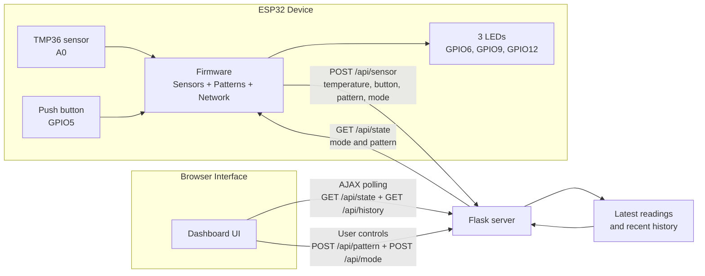

# COM3505 Internet of Things Assignment Report

## Title

Smart Ambient Monitoring Node: An ESP32-Based Sensor and LED Control System Using a Flask Web Interface

## 1. Introduction

This report presents an ESP32-based Internet of Things system developed for the COM3505 assignment. The project satisfies the brief by reading sensor data, controlling three LEDs with dynamic patterns, connecting to Wi-Fi, sending telemetry to a Python Flask server, and providing a live web interface for monitoring and control.

The implemented system uses an Adafruit Feather ESP32-S3, a TMP36 temperature sensor, a push button input, and three LEDs. Sensor readings and device state are transmitted to a Flask server over Wi-Fi, while the browser dashboard shows live telemetry and allows mode and pattern changes without page refresh. The push button also provides local pattern control in manual mode.

## 2. Hardware Setup

The validated hardware configuration comprises an Adafruit Feather ESP32-S3, a TMP36 temperature sensor, a push button, three LEDs, three current-limiting resistors, and standard breadboard wiring. The TMP36 output is connected to analog pin `A0`. The push button is connected between GPIO `5` and ground and uses the ESP32 internal pull-up resistor. The LEDs are connected to GPIO `6`, GPIO `9`, and GPIO `12`, with each LED protected by a series resistor.

Figure 1: Hardware schematic showing the ESP32 connections to the TMP36 sensor, push button, and LED output paths.

## 3. System Architecture

The system is composed of three layers: ESP32 firmware, a Flask backend, and a browser dashboard. The ESP32 performs sensor acquisition, button handling, LED pattern generation, and Wi-Fi communication. The Flask server stores the latest readings and current control state, while the browser dashboard polls the server for live updates and sends user control commands back through the same API. In manual mode, a local button press can also cycle the active LED pattern, after which the updated state is pushed back to Flask.

Figure 2: System architecture showing the ESP32 device, Flask coordination layer, and browser-based monitoring and control.

## 4. Firmware Design

The firmware was implemented as a modular PlatformIO project rather than as a single Arduino sketch. `Thing.cpp` provides the top-level control loop and shared runtime state, `Sensors.cpp` handles temperature sampling and button reading, `Patterns.cpp` implements the LED animation engine, and `Network.cpp` manages Wi-Fi and HTTP communication.

### 4.1 Sensor Acquisition

The system uses two active inputs: a TMP36 temperature sensor and a push button. Temperature is sampled through the ESP32 ADC and converted into degrees Celsius. The button is configured with `INPUT_PULLUP`, so a pressed state is represented by a logic low input.

### 4.2 LED Pattern Engine

The three LEDs are controlled through a logical LED buffer representing red, yellow, and green channels. The implemented patterns are blink, chase, cycle, alert, pulse, and heartbeat. In manual mode, the user can select a pattern from the dashboard or cycle through the pattern list locally using the push button. In automatic mode, the firmware can switch patterns in response to sensor thresholds and button state.

### 4.3 Timing Strategy

The firmware uses `millis()`-based scheduling rather than blocking delays, allowing sensing, pattern animation, and network communication to proceed concurrently.

## 5. Network and Web Integration

The ESP32 connects to the local wireless network in station mode and prints IP details to the serial monitor for debugging. The firmware communicates with the Flask server using HTTP and JSON. The key endpoints are `POST /api/sensor`, `GET /api/state`, `POST /api/pattern`, `POST /api/mode`, and `GET /api/history`. This design keeps the embedded implementation simple while still supporting responsive browser-based control.

## 6. Flask Server and Browser Dashboard

The Flask server stores the latest sensor readings, current operating mode, current LED pattern, and a short history buffer for visualisation. It also serves the dashboard interface used for live temperature and button display, mode and pattern control, device health reporting, and recent history graphing. JavaScript polling is used to fetch updated state and history without requiring a full page refresh, matching the assignment requirement for live browser updates.

## 7. Testing and Results

Testing was performed by running the Flask server locally, connecting the ESP32 to Wi-Fi, and monitoring both the serial output and the browser dashboard. Successful operation was verified through Wi-Fi connection and IP output, regular telemetry uploads, live dashboard updates without refresh, correct browser-based mode and pattern control, visible LED pattern changes, correct button state transitions, and successful local pattern cycling in manual mode. Final testing showed that the ESP32 could connect reliably to the server, upload temperature and button data, update the dashboard in real time, and maintain continuous LED animation.

## 8. Evaluation

The implemented system satisfies the main functional requirements of the assignment. It reads sensor data, controls three LEDs using dynamic patterns, connects to Wi-Fi, exchanges data with a Python Flask server, and supports browser-based live monitoring and control.

The strongest aspect of the project is the separation of concerns across sensing, pattern generation, networking, and presentation. This structure improved debugging, supported incremental development, and made the system easier to explain. The project also includes features beyond the minimum requirements, including automatic mode, a history graph, device health feedback, and local push-button pattern cycling.

One deliberate simplification in the Flask implementation is the use of a module-level global `STATE` object to hold the latest sensor values, device mode, and pattern information. This is acceptable for a small single-user coursework prototype because it keeps the coordination logic simple. However, it has clear limitations: state is lost if the server restarts, concurrency is not handled robustly, and the design would not scale well to multiple devices or multiple worker processes. A stronger alternative would be a persistent store such as SQLite or Redis with explicit device identifiers and structured history records. That would improve reliability and handle edge cases such as simultaneous updates, stale sessions, and multi-device expansion.

The main limitation of the present configuration is that the reserved light input has not yet been validated in the final hardware build. Nevertheless, the system exceeds the minimum sensing requirement because it demonstrates both a working analog temperature input and a working digital button input.

## 9. Conclusion

This project demonstrates a complete ESP32-based IoT system that integrates sensing, LED actuation, Wi-Fi communication, a Flask backend, and a live browser dashboard. The implementation satisfies the assignment brief and extends it with local hardware interaction, multiple animation patterns, automatic behaviour, and a more polished monitoring interface. Overall, the result is a coherent and well-structured IoT application suitable for demonstration and technical discussion.
